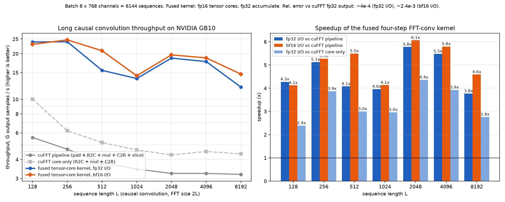

# sfFFT

**Fused tensor-core FFT convolution for long sequences on NVIDIA GPUs, tuned for GB10 (DGX Spark).**

sfFFT computes batched causal long convolutions,

```
y[b, h, n] = sum_{m <= n} u[b, h, m] * k[h, n - m],   n = 0 .. L-1
```

the operation at the heart of long-convolution sequence models (Hyena, H3, S4/SSM-style layers in convolution mode, long filters in audio and signal pipelines). It does this in **one kernel launch per batch**. The whole forward FFT, the pointwise multiply by the filter spectrum, and the inverse FFT run inside shared memory, and the FFT stages run as small dense DFT matrix multiplies on tensor cores.

The included GB10 benchmark records **3.8x to 6.1x speedup** over the cuFFT pipeline below for L = 128 to 8192. These results use the best measured plan for each length and I/O type; performance depends on workload and hardware.



## Origin and thanks

sfFFT began with [Ryan Shea's work on improved exponent bounds for the exact discrete Fourier transform](https://github.com/shea256/fourier-transform-below-nlogn). His findings were so interesting that they pushed us to explore how a powerful improvement in Fourier computation could be put to use in practical GPU workloads. That investigation led to this GB10 convolution kernel. We credit Ryan and his openly shared research as the origin of our work and thank him for sparking it.

Ryan's research draft studies exact-arithmetic asymptotic bounds. sfFFT applies established factored FFT algorithms to finite-precision tensor-core convolution; the speedups below are measurements of that GPU implementation.

## Results (NVIDIA GB10, DGX Spark)

The batch is 8 x 768 channels, which is 6,144 sequences. Times are milliseconds per full batch, and for the fused kernel each one is the best plan per length and I/O type. The cuFFT pipeline is pad, R2C, pointwise multiply, C2R, slice. "cuFFT core" times only R2C, pointwise multiply, and C2R in this implementation. Timing excludes filter-spectrum preparation and cuFFT plan creation.

| L | cuFFT pipeline | cuFFT core | sfFFT fp32 I/O | sfFFT bf16 I/O | speedup vs pipeline (fp32 / bf16) | plan |
|---:|---:|---:|---:|---:|---:|---|
| 128 | 0.141 | 0.079 | 0.033 | 0.034 | 4.3x / 4.1x | 16x16, 4 warps |
| 256 | 0.336 | 0.254 | 0.066 | 0.064 | 5.1x / 5.3x | 32x16, 4 warps |
| 512 | 0.826 | 0.607 | 0.203 | 0.150 | 4.1x / 5.5x | 32x32, 4 warps |
| 1024 | 1.818 | 1.360 | 0.459 | 0.440 | 4.0x / 4.1x | 64x32, 4 warps |
| 2048 | 3.886 | 2.933 | 0.673 | 0.640 | 5.8x / 6.1x | 16x16x16, 8 / 4 warps (fp32 / bf16) |
| 4096 | 7.775 | 5.569 | 1.419 | 1.342 | 5.5x / 5.8x | 32x16x16, 8 warps |
| 8192 | 15.766 | 11.552 | 4.184 | 3.434 | 3.8x / 4.6x | 32x32x16, 8 warps |

The raw output is in [`results/gb10_dgx_spark.csv`](results/gb10_dgx_spark.csv). It was produced with CUDA 13.0 on one GB10 (sm_121, 48 SMs, 101,376 B of shared memory per block, 24 MB L2).

### Accuracy

sfFFT uses **fp16 tensor-core multiplies with fp32 accumulation**, so it trades accuracy for speed.

The benchmark also includes an experimental **fp16 accumulation** mode. Its smaller accumulator scratch space and register footprint may improve speed, at the cost of additional rounding and a smaller accumulation range. Both modes keep fp16 intermediate FFT storage and fp32 twiddle/spectrum arithmetic. Use calibration to decide whether the relaxed mode meets your error budget.

| | relative L2 error |
|---|---|
| cuFFT fp32 pipeline vs fp64 direct convolution | ~3e-7 |
| sfFFT, fp32 input/output, vs cuFFT fp32 output | ~3.3e-4 to 4.7e-4 |
| sfFFT, bf16 input/output, vs cuFFT fp32 output | ~2.4e-3 (dominated by bf16 I/O rounding) |

Suitability for ML training, inference, or signal processing depends on your application's error tolerance. Validate with your own inputs. It is **not** a drop-in replacement for fp32 or fp64 scientific FFT work.

## How it works

For a causal convolution, sfFFT uses a transform of size N = 2L and factors it as N = R0 x R1 (x R2), with radices 16, 32, or 64. This is the four-step / Bailey FFT, the same structure used by Monarch matrices and FlashFFTConv.

* Each stage is a batch of small dense complex DFT matrix multiplies (`F_R @ X`) done with WMMA on fp16 tensor cores with fp32 accumulators. A complex product takes four real MMAs.
* Twiddle factors are computed in registers with `__sincosf` between stages.
* The input is real, so the first forward stage only multiplies the non-zero half. The output is real, so the last inverse stage computes only the real part of the first L rows.
* The filter spectrum is precomputed once per channel, stored in the kernel's digit order, and multiplied in during the last forward stage, which is fused with the first inverse stage.
* One thread block handles one sequence. The working set is held entirely in shared memory, and the batch index varies fastest so each channel's filter spectrum stays hot in L2.

## Build and run

You'll need the CUDA toolkit with cuFFT; the included results were produced with CUDA 13.0. The default target is GB10 (`sm_121`).

```bash
git clone https://github.com/solidsf-inc/sfFFT.git
cd sfFFT
make                    # builds ./sffft for sm_121 (GB10)
./sffft 1 1 128         # small smoke run
./sffft                 # full sweep L = 128..8192, B = 8, H = 768
./sffft 8 768 2048      # one length only
make bench              # sweep + CSV in results/ + plot (needs python3 with matplotlib, numpy)
python3 scripts/plot.py results/<file>.csv docs/benchmark_local.png
make test               # CPU-only precision-selector tests
make test-gpu           # small GB10 precision/CLI regression checks
```

Each output line is `RESULT,L,method,config,ms,rel_err`. Every run reports relative L2 error for the fused kernel against cuFFT, and for cuFFT against an fp64 direct convolution on sample sequences. Numerical errors are reported, without an automatic pass/fail threshold.

## Select by an error budget

Choose a positive relative L2 error target and an explicit I/O type:

```bash
./sffft 8 768 2048 --max-error 1e-3 --io fp32  # 0.1% relative L2 error
./sffft 8 768 2048 --max-error 1e-2 --io bf16  # 1% relative L2 error
./sffft 8 768 2048 --max-error 1e-2 --io any   # allow either I/O type
./sffft 8 768 2048 --max-error 1e-3 --io fp32 --seed 42
./sffft 1 1 128 --max-error 1e-3 --io fp32 --input-scale 15000
```

`10e-3` is `0.01` (1%); `1e-3` is `0.001` (0.1%). The default I/O constraint is `fp32`. Each run measures all supported plans with fp32 and fp16 accumulation, rejects non-finite results, and prints the fastest passing candidate for each requested length:

```text
SELECT,L,method,config,ms,rel_err,max_error,io
```

The error is `||candidate - cuFFT_fp32||₂ / ||cuFFT_fp32||₂`, measured over every output element of the generated calibration batch. BF16 candidate error includes input/output rounding relative to the original fp32 inputs. A zero reference passes only if the candidate is also exactly zero. If no fused candidate meets the budget, the program prints `NO_MATCH,L,io,max_error` and exits with status 2. Invalid arguments exit with status 1. It does not silently relax the target or switch to cuFFT.

This is an empirical calibration selector. It reports a plan/configuration, and the current convolution interface remains the CUDA kernel in `src/sffft.cu`. A positive target does not guarantee that a matching mode exists, and passing generated inputs does not guarantee the same error on other data. Test representative inputs, amplitudes, and filters before reusing a selected configuration. `--seed` changes the generated calibration inputs reproducibly; `--input-scale` multiplies the generated input amplitudes so you can probe range and overflow. The reusable host selector in [`src/selection.h`](src/selection.h) accepts measured candidates from your own calibration workflow.

Times cover the convolution kernels; calibration, filter-spectrum preparation, allocation, and BF16 input conversion are excluded. Keep I/O fixed when comparing execution speed for an application. `--io any` allows a data-type change explicitly.

Method names `fused_fp32io` and `fused_bf16io` retain fp32 accumulation. `fused_fp16acc_fp32io` and `fused_fp16acc_bf16io` identify fp16 accumulation. The included historical benchmark table and plot above use fp32 accumulation.

### GB10 precision/speed experiment

At the original batch size of 8 x 768 channels, three sequential sweeps with CUDA 13.2 compared both accumulation modes in the same binary. The table uses the fastest plan by median time across the three repeats, with BF16 I/O fixed. These generated inputs met a 1% error budget with substantially less error:

| L | FP32 accumulate, BF16 I/O (ms) | FP16 accumulate, BF16 I/O (ms) | speedup | FP16 accumulate relative L2 error |
|---:|---:|---:|---:|---:|
| 128 | 0.033 | 0.029 | 1.13x | 0.241% |
| 256 | 0.064 | 0.055 | 1.15x | 0.240% |
| 512 | 0.150 | 0.129 | 1.16x | 0.240% |
| 1024 | 0.467 | 0.378 | 1.24x | 0.244% |
| 2048 | 0.642 | 0.487 | 1.32x | 0.244% |
| 4096 | 1.331 | 1.032 | 1.29x | 0.242% |
| 8192 | 3.491 | 3.152 | 1.11x | 0.242% |

Raw candidate timings and selections are in [`results/gb10_precision_sweep.csv`](results/gb10_precision_sweep.csv). FP16 accumulation was 1.11x–1.32x faster in this experiment, with about 0.24% relative L2 error. This is a measured improvement for the supplied workload, and does not establish a worst-case error bound. FP32 I/O candidates with FP16 accumulation measured approximately 0.05%–0.07% error, allowing a 0.1% target on these inputs.

## GB10 allocation modes

sfFFT can allocate its owned buffers using device memory, managed memory, mapped CPU memory, or a hybrid of mapped I/O and device workspaces:

```bash
./sffft --memory-info
./sffft 8 768 2048 --max-error 1e-2 --io bf16 --allocator device
./sffft 8 768 2048 --max-error 1e-2 --io bf16 --allocator managed
./sffft 8 768 2048 --max-error 1e-2 --io bf16 --allocator mapped
./sffft 8 768 2048 --max-error 1e-2 --io bf16 --allocator hybrid --kernel auto
```

`device` remains the default. `mapped` uses `cudaHostAllocMapped` and the CUDA device alias, providing a CPU allocation that the GPU can access directly. `managed` uses `cudaMallocManaged`, with prefetching when concurrent managed access is supported. Both host-visible modes generate the input and filter directly in shared CPU/GPU allocations, and validate outputs through synchronized CPU views. The filter-spectrum workspace is allocated once per length and reused across all plans.

`hybrid` keeps input, output, reference output, and the initial filter buffer CPU-visible, while GPU-only workspaces, the converted BF16 input, filter spectra, and coefficient tables use `cudaMalloc`. CPU validation reads the mapped outputs after synchronization. The small coefficient tables are explicitly uploaded; data buffers need no explicit upload or download.

The implementation uses public CUDA APIs. GB10 has a shared physical memory architecture; this mode does not create a separate Grace/HBM memory tier. [NVIDIA's Spark porting guide](https://docs.nvidia.com/dgx/dgx-spark-porting-guide/porting/cuda.html) explains that `cudaMalloc` allocations on Spark cannot be coherently accessed by the CPU, while [CUDA's memory guide](https://docs.nvidia.com/cuda/cuda-programming-guide/02-basics/understanding-memory.html) describes managed and mapped allocations. Allocator support is checked at runtime, and unsupported requests fail explicitly.

`RESULT` and `SELECT` continue to measure warmed GPU execution. Additional `MEMORY` rows report owned allocation bytes, persistent host shadow bytes, allocation time, explicit upload/download bytes, explicit copy time, and constructor setup time. Setup includes the benchmark's generated inputs and cuFFT plan/spectrum preparation. These fields separate allocator/setup effects from kernel speed; cuFFT's internal workspaces and temporary validation vectors are outside the owned-buffer byte count. Host-visible modes avoid explicit host/device copies but still access physical memory and may incur coherence or page-management costs.

### Cached coefficients and automatic kernel selection

`--kernel cached` loads precomputed FP16 DFT matrices instead of regenerating them inside every block. The table contains 21 KiB of coefficients for radices 16, 32, and 64. Stages with the same radix share one DFT matrix in shared memory in both kernel variants, reducing allocation and initialization work. Twiddles remain computed on the GPU: experimental cached twiddle loads were slower at longer lengths. The transform and convolution remain fused in one launch.

`--kernel auto` measures both cached and legacy kernels with both accumulation types, then `--max-error` selects the fastest eligible configuration. Configurations include `kernel_cached` or `kernel_legacy` so the choice is reproducible. `--kernel legacy` remains the default. Caching exchanges computation for memory loads, so its value depends on length, plan, and allocator; validate performance and error on your workload.

## Status and limitations

This is an early release. Please read these before you depend on it.

* **It's a convolution kernel, not a general FFT library.** Today sfFFT does batched causal 1-D convolution with real input and output. Standalone forward and inverse FFTs, complex input, non-causal or circular convolution, and 2-D transforms aren't exposed yet.
* **Lengths.** It supports L = 128 to 8192, with each length a power of two. Past 8192 the working set doesn't fit in one block's shared memory, so longer sequences need a multi-pass version, which isn't implemented yet.
* **Hardware.** It has only been tuned and validated on GB10 (sm_121). You can select a different CUDA target with `make ARCH=sm_90`, for example, but compatibility and performance elsewhere are unvalidated. The largest plans require up to 92,160 bytes of shared memory per block.
* **API.** The kernel currently lives in a single benchmark source file, `src/sffft.cu`. A header-only library interface and PyTorch bindings are natural next steps.

## Prior art

The algorithms here are well established. sfFFT's contribution is a fused, single-launch implementation tuned for GB10, with measured results.

* D. H. Bailey, "FFTs in external or hierarchical memory," 1990 (the four-step FFT).
* T. Dao et al., "Monarch: Expressive Structured Matrices for Efficient and Accurate Training," ICML 2022.
* D. Y. Fu et al., "FlashFFTConv: Efficient Convolutions for Long Sequences with Tensor Cores," 2023.
* M. Poli et al., "Hyena Hierarchy: Towards Larger Convolutional Language Models," ICML 2023.

## License

Copyright 2026 solidSF, Inc. Licensed under the [MIT License](LICENSE). CUDA and cuFFT are external NVIDIA dependencies and are not included in this repository.
